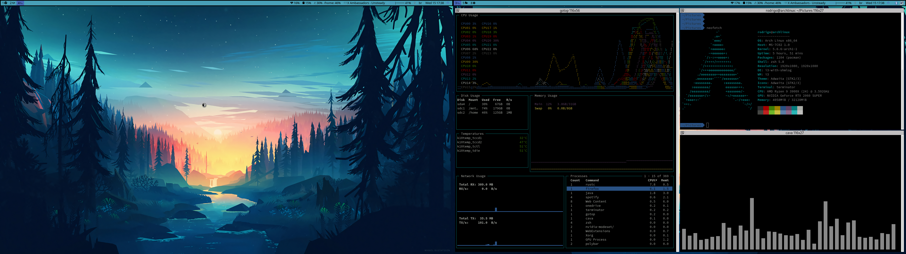

# Dotfiles

My personal dotfiles for a **niri** (scrollable-tiling Wayland compositor) setup on
Arch/Manjaro. Configs are deployed with [GNU Stow](https://www.gnu.org/software/stow/).



The desktop stack:

| Role              | Tool                                   |
| ----------------- | -------------------------------------- |
| Compositor / WM   | niri                                   |
| Status bar        | waybar                                 |
| App launcher      | fuzzel                                 |
| Notifications     | mako                                   |
| Wallpaper         | swaybg                                 |
| Lock / idle       | swaylock / swayidle                    |
| Display config    | kanshi                                 |
| Terminal          | alacritty                              |
| Shell             | zsh                                    |
| Editor            | neovim                                 |

## Install

### Automated (recommended)

The `bootstrap/` script installs dependencies, clones the repo to `~/.dotfiles`,
and deploys configs. Works on Debian, Ubuntu and Manjaro/Arch. See
[`bootstrap/README.md`](bootstrap/README.md).

```bash
curl -fsSL https://raw.githubusercontent.com/rodrigomideac/dotfiles/master/bootstrap/bootstrap.sh | bash
```

### Manual (Manjaro/Arch)

Install the desktop dependencies, then deploy the configs:

```bash
./deps_v2.sh   # installs the niri/Wayland stack via yay
make stow
```

Or install the essentials by hand:

```bash
sudo pacman -S niri fuzzel waybar mako swaybg swaylock swayidle kanshi \
    xwayland-satellite xdg-desktop-portal-hyprland plasma-polkit-agent udiskie \
    alacritty zsh neovim atuin stow
```

> `stow` refuses to overlay existing files. Move or delete any conflicting
> configs in `~` / `~/.config` before running `make stow`.

## Deploying configs

The `Makefile` wraps the stow invocations:

| Target           | What it does                                              |
| ---------------- | -------------------------------------------------------- |
| `make stow`      | Symlink `.config`, `vim`, `zsh`, `scripts`, `tmux`       |
| `make stow-sudo` | Install systemd system services (power-profile, resume)  |
| `make stow-work` | `make stow` plus the bash `.profile` (work machines)     |

## Further configuration

### systemd user services

After `make stow`, reload and enable the user services:

```bash
systemctl --user daemon-reload
systemctl --user enable --now kanshi.service
systemctl --user enable --now solaar.service
systemctl --user enable --now swaybg.service
systemctl --user enable --now swayidle.service
systemctl --user enable --now ssh-agent.service

sudo systemctl enable --now NetworkManager.service
sudo systemctl enable --now ydotoold.service
```

### Fonts

Icons in waybar and the terminal need a Nerd Font:

- [Iosevka Nerd Font](https://www.nerdfonts.com/) (used by waybar)
- [Noto Sans](https://archlinux.org/packages/extra/any/noto-fonts/)
- [Fira Code](https://archlinux.org/packages/extra/any/ttf-fira-code/)

### Kanshi — dynamic monitor configuration

List output names with `niri msg outputs`, then edit
[`.config/kanshi/config`](.config/kanshi/config). Restart with
`systemctl --user restart kanshi`.

### Waybar — status bar

Changes require `systemctl --user restart waybar`. Debug with
`journalctl --user -u waybar -f`.
